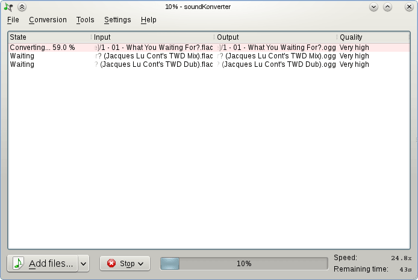

# soundKonverter
soundKonverter is a frontend to various audio converters.

The key features are:
- Audio conversion
- Replay Gain calculation
- CD ripping

See the [wiki](https://github.com/HessiJames/soundkonverter/wiki) for more information.
